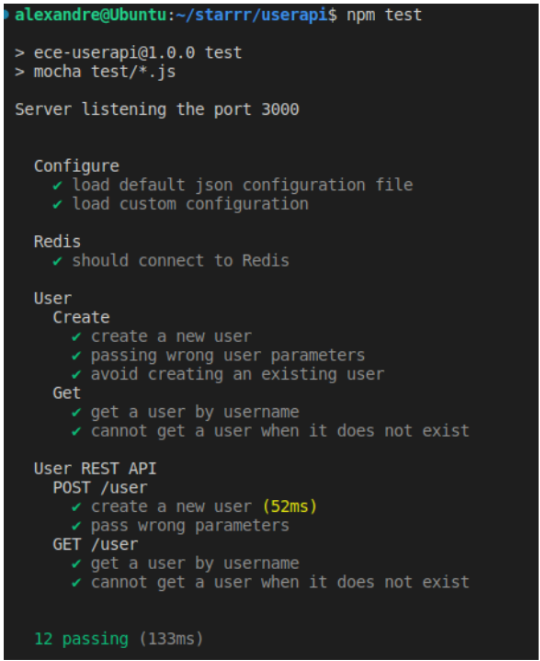

# DEVOPS PROJECT

This is our Devops project that we managed to do after learning diferent tools during the semester. 

# Authors 
 BENSARSA Alexandre <br>
CHAOUACHI Soraya <br>
SI INTER TD 1 <br>

# 1. Creation of a web application 

We created an application using the programming language NodeJS, and for the database where we stored the data we used Redis. <br>
Also, we have configured ther server and the application to be able to run on the port 3000.  <br>
After that, we covered the application with diferent test of diferent levels, in total we had 12 tests. <br>
All the test are functioning and we had respectivelly : <br>



-> one test for Redis connection 
This first test is checking the application's ability to perform the connection with Redis database but also
the interaction to it. <br>
This test tipically involves connecting to Redis server, performing read/write operation and disconnecting. 
<br>

-> two tests for the configuration <br>
This test concerns to ensure the correct configuration of the application and the environment the application is running in. <br>   
- for the environement configuration test we are checking environment variables, server setting and that all the files are loaded, in our case the load of JSON configuration file and also the load of custom configuration.  <br>  
- for the dependency configuration test its goal is to ensure that the application can correctly access and utilize its dependecies.  
<br>

-> four tests for the user REST API <br>
Those four tests are focusing on the user and most specifically on REST API endpoints. <br> 
This test can be declined into four  tests: <br> 
- The first one POST/user will create a new user by sending a POST request to the /user endpoints with the necessary parameters to create a new user. <br>
- The second one also POST/user will validates API's error handling by intentionnaly sending incorrect parameters to the POST. <br>
- The thrid one will concern GET/user and will ensure teh 'Read Operation' by requesting user information<br> 
- The last one will be similar to the POST test by checking the API hndlor's error for GET requests and this by sending  the GET request to /user endpoint with incorrect query parameters. <br>


-> five tests using CRUD methods for the user <br>
 CRUD stands for Create, Read, Update, and Delete. Thus, the five tests that uses CRUD methods are most of<br>
 them the basic operations that can be performed on the user data in the application. <br>

1. Create test testing if we can create a new user into our system <br>
2. Read test testing that the system can retrieve user information and thus by passing wrong user parameters. <br> 
3. The third test's goal is to avoid creating an existing user. <br>
4. This one is to be able to get a user by its username. <br> 
5. The last one is to test getting a user when it does not exist. <br>


# 2. Application of CI/CD pipeline 

Here we are choosing to apply continuous integration and continuous delivery/deployment pipeline using Azure pipeline. <br>
The deployment through Azure pipelines has been setup and rigorously tested. The screenshots illustrates the <br> successful execution of various tests. Validating every test, every commit that represent an integral <br>part of our CI/CD process is very important to ensure the stability and the functionality of our application. <br> 

Indeed, Azure pipeline present diferent advantages as Scalability, Integrated Environment, Flexibility and <br>
control and en Enchanced security.<br>

 <br>
We can see here notice a cloud servies platform that shows : <br>
- Azure Cache for Redis: which represents a cache for redis that enhances the performance of the application.<br>
- Ressource Group corresponds to a container that holds ressources for an Azure solution. <br>
- App Service: a platform for building, deploying and scaling web applications. <br> 


Here we can notice that our AppService is currently running which means that our web application is well deployed. <br>

Here is the link to our node js file that made possible the continuous integration https://github.com/alexben300502/starrr/blob/main/.github/workflows/node.js.yml <br>

And here's the link that made possible the delivery and the deployment on Azure pipeline. <br>
https://github.com/alexben300502/starrr/blob/main/.github/workflows/main_starrr-devops-project.yml <br>

And here we can notice that our web application is deployed on Azure and visible at [ADD LIEN]. 

# 3. Configure and provision a virtual environment and run application using the IaC approach


For this part, the goal is to configure a VM for testing and laucnhing our application in a VM centos7 form the redhat family, thanks to Vagrant. We will be doing that in a folder iac.

Firstly, we create a vagrant file : https://github.com/alexben300502/starrr/blob/main/iac/Vagrantfile

In it, as you can see thanks to the comments, we configure the VM, and how it will work. Thanks to this vagrantFile, we are able to enter the VM through Windows as you can see in the following picture : 


We had many troubles to access the Vm due to ssh key access, so we had to disable the automatic injection of key made by Vagrant.

After that, we configured playbook with a run.yml file that will run the roles and tasks, and 2 main.yml files : one for installing all dependencies and another for health checks. As you can see in this folder : https://github.com/alexben300502/starrr/tree/main/iac/playbooks

After all that is good, we can run many checks inside the VM to see that our application work : 


In this image we can see that all installation, enable and installing app are working. 

Then we test our installation : 


Here we can see that Node and redis are well installed inside the VM centos.

And on this final picture we were able to perform the check of the installation and the healthchecks that means that the application is well installed and healthy inside the VM : 


# 4. Build Docker image of your application

For this part of the project after creating a dockerignore and a docker file we build the docker image. <br>
We managed to push it on our dockerhub with login using respectively docker build -t devopsproject and <br>
docker push alexben3005/project-image:latest


Here, we can see a docker Hub repository page.<br>
The repository name userapi represents the unique identifier for the Docker image on Docker Hub.<br>
Also, the "Public View" button, suggesting that this page can be viewed by the public
And the presence of the repository and the "Last pushed" means that we had a built that occurred and that <br>
the image has been successfully uploaded to Docker Hub. <br>
There are many advantages of building images on Docker hub: Centralized repository,version control <br>
Automated builds, Scalability, Public and Private Access and finally for Kubernetes.<br>
Indeed,  Kubernetes will be able to use Docker images to create containers. The images will thus <br>
represent the application environment. This ensures that the application run the same way in all kind <br>
of possible environments.

# 5  Make container orchestration using Docker Compose 

To be able to containerize our development workflow, we have employed Docker compose it is a tool that is<br>
able to run multiple-container Docker application. Indeed, we are able in single file to configure our <br>
application services, networks and volumes. <br>


In this part of our project, we will be creating a docker-compose.yml (mettre le lien) to start the <br>
application. <br> 

Our docker-compose.yml defines two services: <br>
- web application service: it is setting up the correct envrionement for the web server to run. <br>
- redis service utilizes the Redis image from Docker hub. <br>

To start the docker-compose file we have just created we managed to do it with docker-compose up to be able
<br>
 to run it into the container we have just created. <br>

Now we are going to use the software postman which is a tool for testing  and interacting with application<br>
programming interfaces. <br> 


Also, as we can see on the image, the terminal indicates the successful creation of various components <br>
that represents basic elements in a containerized application; such as network, volume, and containers.


Here we can notice from the terminal that we have a container creation, redis that is starting, also server inizalization with redis server that is listening on port 6379. Finally we can notice that the server finished its initialisation and will be from now ready to accept connections over TCP.


Here we see that Node.js application is starting and we notice that the server is listening to port 3000<br>.

After that we check the application on http://localhost:3000/ and we can see that the print of "Hello World!"
<br> is successful. 


# 6. Docker container orchestration with Kubernetes 

Here the goal is to Install Kubernetes cluster using Minikube. After that, we will create kubernetes files such as deployments, PV, PVC and services.

Firstly we create a kubernetes cluster thanks to the following command: 
```
minikube start 
```

Or 

```
minikube start --memory=8000 --cpus=4 --kubernetes-version=v1.27.0
```
If you have not sufficient space to allocate from your PC to minikube. (Here we limit the memory to 8000)


All thoses files are accessible in this folder : 
https://github.com/alexben300502/starrr/tree/main/k8s

We apply those files in the cluster like in the following example : 


After that they are all applied, we can see that all the files are correctly applied because when we run the command : 
```
kubectl get pods
```

We have this result : 


We can see in this picture that we created 3 replicas and that 2/2 pods are running.

# 7. Service Mesh with Istio 

TO DO : It has been done for the labs as you can see in the following folder : 
https://github.com/alexben300502/starrr/blob/main/labs/lab9/README.md

It has to be adjusted for the project, to firstly inject Istio in our cluster from the previous task and to implement route requests between 2 different versions of userapi and traffic shifting between 2 different versions of userapi.