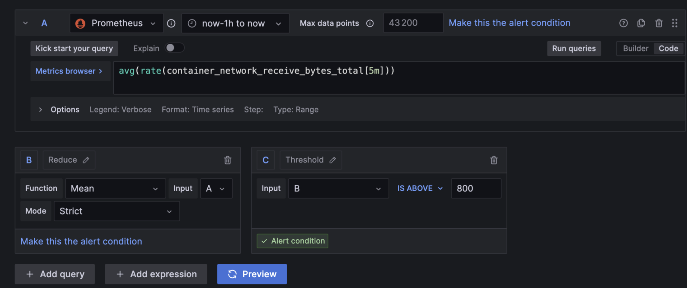

# DEVOPS PROJECT

```
This is our Devops project that we managed to do after learning diferent tools during the semester. 
```

# Authors 
 BENSARSA Alexandre <br>
CHAOUACHI Soraya <br>
SI INTER TD 1 <br>

# 1. Creation of a web application 

We created an application using the programming language NodeJS, and for the database where we stored the data we used Redis. <br>
The following folders: routes https://github.com/alexben300502/starrr/blob/main/userapi/src/routes/user.js and controllers https://github.com/alexben300502/starrr/blob/main/userapi/src/controllers/user.js allowed us to make changes for the user in the database. Thus, controller will be called when it will receives routes.
Also, we have configured the server and the application to be able to run on the port 3000.  <br>
After that, we covered the application with diferent test of diferent levels, in total we had 12 tests. <br>
All the test are functioning and we had respectivelly : <br>


-> one test for Redis connection 
This first test is checking the application's ability to perform the connection with Redis database but also
the interaction to it. <br>
This test tipically involves connecting to Redis server, performing read/write operation and disconnecting. 
<br>

-> two tests for the configuration <br>
This test concerns to ensure the correct configuration of the application and the environment the application is running in. <br>   
- for the environement configuration test we are checking environment variables, server setting and that all the files are loaded, in our case the load of JSON configuration file and also the load of custom configuration.  <br>  
- for the dependency configuration test its goal is to ensure that the application can correctly access and utilize its dependecies.  
<br>

-> four tests for the user REST API <br>
Those four tests are focusing on the user and most specifically on REST API endpoints. <br> 
This test can be declined into four  tests: <br> 
- The first one POST/user will create a new user by sending a POST request to the /user endpoints with the necessary parameters to create a new user. <br>
- The second one also POST/user will validates API's error handling by intentionnaly sending incorrect parameters to the POST. <br>
- The thrid one will concern GET/user and will ensure the 'Read Operation' by requesting user information<br> 
- The last one will be similar to the POST test by checking the API handlor's error for GET requests and this by sending  the GET request to /user endpoint with incorrect query parameters. <br>


-> five tests using CRUD methods for the user <br>
 CRUD stands for Create, Read, Update, and Delete. Thus, the five tests that uses CRUD methods are most of<br>
 them the basic operations that can be performed on the user data in the application. <br>

1. Create test => testing if we can create a new user into our system <br>
2. Read test => testing that the system can retrieve user information and thus by passing wrong user parameters. <br> 
3. The third test's goal is to avoid creating an existing user. <br>
4. This one is to be able to get a user by its username. <br> 
5. The last one is to test getting a user when it does not exist. <br>


# 2. Application of CI/CD pipeline 

Here we are choosing to apply continuous integration and continuous delivery/deployment pipeline using Azure pipeline. <br> The file that was configured for this part is the following one :<br> 
https://github.com/alexben300502/starrr/blob/main/.github/workflows/main_starrr-devops-project.yml . <br>
The deployment through Azure pipelines has been setup and rigorously tested. The screenshots illustrates the <br> successful execution of various tests. Validating every test, every commit that represents an integral <br>part of our CI/CD process is very important to ensure the stability and the functionality of our application. <br> 

Indeed, Azure pipeline present diferent advantages as Scalability, Integrated Environment, Flexibility  <br>
control and en Enchanced security.<br>

We can  here notice a cloud servies platform that shows : <br>
- Azure Cache for Redis: which represents a cache for redis that enhances the performance of the application.<br>
- Ressource Group corresponds to a container that holds ressources for an Azure solution. <br>
- App Service: a platform for building, deploying and scaling web applications. <br> 

 <br>


Here we can notice that our AppService is currently running which means that our web application is well deployed. <br>


Here is the link to our node js file that made possible the continuous integration https://github.com/alexben300502/starrr/blob/main/.github/workflows/node.js.yml <br>

And here's the link of the file that made possible the continuous deployment on Azure pipeline. <br>
https://github.com/alexben300502/starrr/blob/main/.github/workflows/main_starrr-devops-project.yml <br>

And here we can notice that our web application is deployed on Azure and visible at https://starrr-devops-project.azurewebsites.net/. <br> And we can see that it is working : 


# 3. Configure and provision a virtual environment and run application using the IaC approach

For this part, the goal is to configure a VM for testing and laucnhing our application in a VM centos form the redhat family, thanks to Vagrant. We will be doing that in a folder iac.


Firstly, we create a vagrant file : https://github.com/alexben300502/starrr/blob/main/iac/Vagrantfile


In it, as you can see thanks to the comments, we configure the VM, and how it will work. Thanks to this vagrantFile, we are able to enter the VM through Windows as you can see in the following picture : 

```
vagrant up 
#or 
vagrant up --provision #if we made changes we run this command
```

Once we are inside the VM, we run the following command : 

```
vagrant ssh
```


We had many troubles to access the Vm due to ssh key access, so we had to disable the automatic injection of key made by Vagrant.

After that, we configured playbook with a run.yml file that will run the roles and tasks, and 2 main.yml files : one for installing all dependencies and another for health checks. As you can see in this folder : https://github.com/alexben300502/starrr/tree/main/iac/playbooks

After all that is good, we can run many checks inside the VM to see that our application work : 


In this image we can see that all installation, enable and installing app are working. 

Then we test our installation : 


Here we can see that Node and redis are well installed inside the VM centos.

And on this final picture we were able to perform the check of the installation and the healthchecks that means that the application is well installed and healthy inside the VM : 


# 4. Build Docker image of your application

For this part of the project, after creating a dockerignore and a docker file, we build the docker image with the following command : <br>

```
docker build -t devopsproject
```

We managed to push it on our dockerhub with login using : 

```
docker push alexben3005/project-image:latest
```


<br>
Here, we can see a docker Hub repository page.<br>

The repository named userapi represents the unique identifier for the Docker image on Docker Hub.<br>
And the presence of the repository and the "Last pushed" means that we had a built that occurred and that <br>
the image has been successfully uploaded to Docker Hub. <br>
There are many advantages of building images on Docker hub: Centralized repository,version control <br>
Automated builds, Scalability, Public and Private Access and finally for Kubernetes.<br>
Indeed,  Kubernetes will be able to use Docker images to create containers. The images will thus <br>
represent the application environment. This ensures that the application run the same way in all kind <br>
of possible environments.


# 5.  Make container orchestration using Docker Compose 

To be able to containerize our development workflow, we have employed Docker compose, it is a tool that is<br>
able to run multiple-container Docker application. Indeed, we are able in a single file to configure our <br>
application services, networks and volumes. <br>


In this part of our project, we will be creating a docker-compose.yml  to start the <br>
application https://github.com/alexben300502/starrr/blob/main/userapi/docker-compose.yml . <br> 


Our docker-compose.yml defines two services: <br>
- web application service: it is setting up the correct envrionement for the web server to run. <br>
- redis service : it pulls the Redis image. <br>

To start the docker-compose file we have just created, we managed to do it with the following command :
```
docker-compose up
```


Also, as we can see on the image, the terminal indicates the successful creation of various components <br>
that represents basic elements in a containerized application; such as network, volume, and containers.

<br> 
 

<br> 

Here we can notice from the terminal that we have a container creation, redis that is starting, also server inizalization with redis server that is listening on port 6379. Finally we can notice that the server finished its initialisation and will be from now ready to accept connections over TCP protocols.

Here we see that Node.js application is starting and we notice that the server is listening to port 3000, on the localhost. <br> 


After that we check the application on http://localhost:3000/ and we can see that the print of "Hello World!"
<br> is successful. 


# 6. Docker container orchestration with Kubernetes 

Here, the goal is to Install Kubernetes cluster using Minikube. After that, we will create kubernetes <br>
files such as deployments, persistent volumes, persistent volume claim and services. <br>

Step 1: we are going to start a Minikube cluster. Minikube represents a tool allowing to run Kubernetes locally. To launch minikube, after installing it, we launch the following command : 
```
minikube start
```

We can here notice the output where Minikube has been successfully started with the Docker Driver. 
<br>


<br>
Many steps are here considered as Docker being restarted, image being extracted.. <br>
At the end, we can see that kubectl is now configured to use Minikube as the default cluster.<br>

**Note:** To be able to launch minikube, we had to disable the VM driver because the BIOS were not working in Windows. 
```
kubectl config unset vm-driver
```

After that, we allocated 7000 instead of 16384 in the minikube cluster. Thanks to the following command : 
```
minikube start --memory=7000 --cpus=4 --kubernetes-version=v1.27.0
```

We put 7000 for an optimize use of kubernetes.


Step 2: we are here going to apply our files to the cluster.
We execute the command :
```
kubectl apply -f service.yaml
```
To apply a configuration file named service.yaml to the Kubernetes cluster to enable network access to a set of Pods. As a result we can notice the creation in the cluster of a service named project-devops-service. <br>


In the same way, we are here executing the command :
```
kubetcl apply -f persistentvolume.yaml
```
As a result we notice the creation of a persistent volume named "task-pv-volume" in the cluster to manage storage in the cluster preserving data even when pods are deleted.<br>


Also, by applying 
```
kubectl apply -f storageclass.yaml
```

The result is the creation of a storage class ressource named "manual" in the Kubernetes cluster. We use Storage class to define diferent classes storage that can be dynamically provisionned to pods as persistent volumes. 


In the same logic, we apply commands kubectl apply -f deployment.yaml to create deployment. Then kubectl apply -f persistentvolumeclaim.yaml to create persistentvolumeclaim to request storage resources from the cluster.

Step 3: We are checking here that everything is working correctly. <br>

By applying the command kubectl get persistentvolume we can see a list of two persistent volumes.<br>
First one with a capacity of 10Gi and the second one name 'task-pv-volume' with a capacity of 1GI and has been up for 61 minutes.


<br>
Then, by applying the command 
```
kubectl get pods
```
We can notice that we have here three replicas with three diferent suffix names. We can see that each pod is ready with the 2/2 in the READY column that meaning that each container of the pod is running. <br>


After that, by applying the command 
```
kubectl get services
```
We have a list of the various services in the cluster. For example here we can see project-devops-service that exposes the NodePort at the IP address "10.97.8.157" on port "30607/TCP and it is running since 72 minutes.


We notice here the default Kubernetes service named kubernetes, the cluster-IP is 10.96.0.1 and represents an internal IP address reachable in the cluster and we also see that te port 444 is used for HTTPS traffic.


Finnaly, we apply 
```
kubectl get deployment
```

To be able to list deployments in the Kubernetes cluster. The output shows us that the name of the deployment is `project-devops`. 


Everything seems to be working so we use minikube for the deployment :  <br>


We can notice the service that we saw when typing kubectl get services : project-devops-service<br>
In the terminal, there are two sections : <br>

The first section lists a service in Kubernetes:<br>
The second section indicates that a tunnel has been started for the project-devops-service, which is a way to expose the service on a local machine for testing or development. 


# 7. Service Mesh with Istio 

To make service mesh, we have to use the cluster we used for the last part k8s. <br> 
To be able to launch minikube, we had to disable the VM driver because the BIOS were not working in Windows. 
```
kubectl config unset vm-driver
```

After that, we allocated 7000 instead of 16384 in the minikube cluster. Thanks to the following command : 
```
minikube start --memory=7000 --cpus=4 --kubernetes-version=v1.27.0
```

Then, once the cluster is launched, we can start to configure ISTIO. <br> 
Once it’s done by running minikube, we configure istio with the commands :  <br> 
"istioctl install --set profile=default -y" <br> 

Then we enable the namespace : <br> 
"kubectl label namespace default istio-injection=enabled" <br> 

Then we apply manifest generate : <br> 
"istioctl manifest generate | kubectl apply -f -" <br> 

And finally, we check if it worked :  <br> 
```
kubectl get pods -n istio-system
```
<br> 


And if we check, we see that now there are 3 pods including istio running for project devops : <br>


Here, we can see that we have 3/3 so istio is well injected. <br>


After that, we have to apply our 3 documents that you can find in this folder : lien

<br>
Here we firstly have the gateway.yml file https://github.com/alexben300502/starrr/blob/main/istio/gateway.yml, that permits to expose the service. 
<br>
Then we create a destinationrule.yml https://github.com/alexben300502/starrr/blob/main/istio/destinationrule.yml that will define subsets for routing for the two versions, v1 and v2, of our userapi. 
<br>
Finally, we Create a VirtualService.yml https://github.com/alexben300502/starrr/blob/main/istio/virtualservice.yml  file to route and shift traffic between the two versions. The <br> goal is to routes incoming requests to the project-devops-service, with a heavenly weight of each v1 <br>and v2 subsets. 
 

After doing it, we can run the following command to apply those files :  <br>
"kubectl apply -f istio" <br>


And then to check if it worked correctly and to see traffic flow and to see traffic shifting, we use kali as in the lab9. 


# 8 Implementing Monitoring to your containerized application 
Step n°1: Using services and deployments from our Istio installation folder. <br>


Step n°2: Verification that deployments, services and pods are running. <br>
We first verifiy that deployments are running correctly by executing the following command : "kubectl <br>
get deployments -n istio-system" . <br>
The output after the execution of this command is showing us 4 deployments: <br>
-Graphana <br>
-Jaeger<br>
-Kiali <br>
-Promotheus <br>


We can see that for each deployment the pods are available and ready.
<br>
Then we execute the command "kubectl get services -n istio-system". <br>
The output shows us the various services within the Istio system namespace. <br>
All of those services are part of stack for Kubernetes Cluster and enables monitoring .


Finnaly, we finish this step by running the command "kubectl get pods -n istio-system".<br>
The output of the terminal lists pods in the Istio-system namespace of a Kubernetes cluster. <br>
We notice that all pods are effectively running and have been up for the same amount of time, indicating 
<br> 
they were  started simultaneously as part of the Istio service mesh setup. 


Step n°3:  To be able to  forward a local port to a port on a Grafana pod within the Istio-system  <br>
we are going to use the command "kubectl -n istio-system port-forward <br>
grafana-b8bbdc84d-4s715" that includes the pod we have seen in past images. <br>
The output of the command shows us the following message "Handling connection for 3000"  suggest that <br> there have been several connections made to the local port, which are being forwarded to the Grafana <br> service.


<br>

Step n°4: We are finnaly able to access Graphana UI.


Step n°5: Here we are going to deploy prometheus pod to localhost. <br>
To be able to do this we are going to use the following command 
```
kubectl -n istio-system port-forward prometheus-db8b4588f-f972p 9090:9090
``` 
The output indicates that the local machine has handled connections on port 9090 at least twice.


Step n°6: Accessing prometheus UI with localhost:9090 <br>



Step n°7: Checking prometheus status


Step n°8: Link in Graphana to Prometheus server
To be able to do the link between them we go on Graphana in settings and data Source and we put <br>
into the HTTP part the url of prometheus local host which is : http://localhost:9090 <br>


Step n°9: Creating Alerts 

We started by choosing a dashboard and importing it on graphana by its ID. <br>
Our dashboard represents average rate of received bytes over time <br>


 <br>
The alert type will notify if the average received bytes over a 5-minute period exceeds a certain threshold, which might indicate unusual network activity.<br>
Then we managed to define all the parameters for the alert.<br>
 The specific query  is 
 ```
 avg(rate(container_network_receive_bytes_total[5m]))
 ```
 Which calculates the <br> average rate of received network bytes for containers over the last 5 minutes. <br>
 To the right, there's an alert configuration section where a threshold is set. The condition is configured to trigger an alert if the value is above 800 bytes.
 <br>


 Finnaly we set the notifications parameters by putting graphana default email.  <br> 
