# LAB9 INSTRUCTIONS : 

## 1. BEFORE STARTING

To be able to launch minikube, we had to disable the VM driver because the BIOS were not working in Windows. 
```
kubectl config unset vm-driver
```

After that, we allocated 7000 instead of 16384 in the minikube cluster. Thanks to the following command : 
```
minikube start --memory=7000 --cpus=4 --kubernetes-version=v1.27.0
```

Then once the cluster is launched, we can start to configure ISTIO

## 1. Start to configure Istio

First we configure Istio using the documentation of the official website. We obtain results like this : 
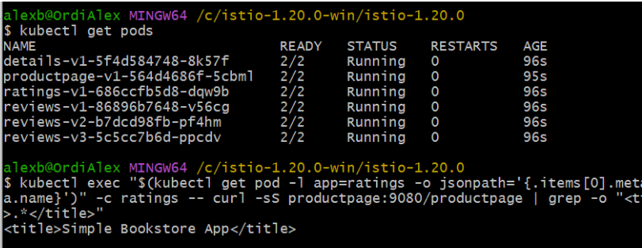

Then we add the gateways : 
Capture d'écran 2023-12-22 192518.png
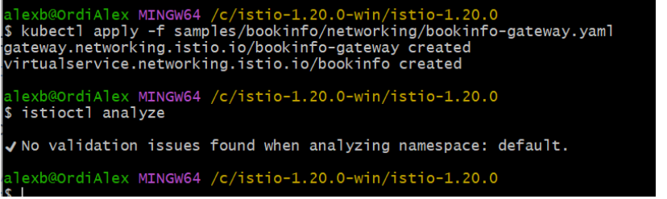

Then we configure the app, that means that we configure to open the application to outside traffic, and to Determine the ingress IP and ports. After that, once it's done
Then we can launch the minikube tunnel : 

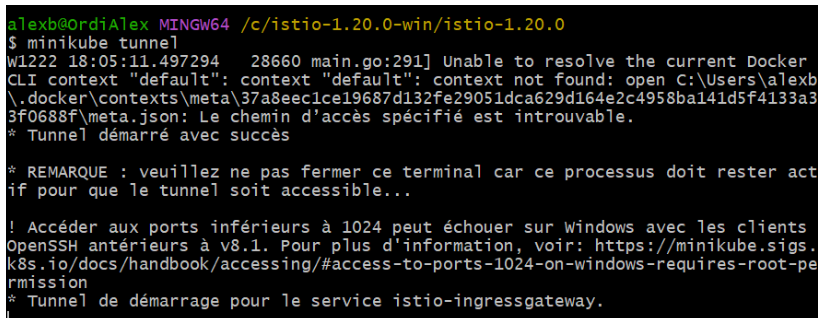

After that we verify external access thanks to the following command : 
```
echo "http://$GATEWAY_URL/productpage"
```
That will display the address of the product page of the bookinfo page. 

After that we can access the kiali dashboard thanks to the commands : 
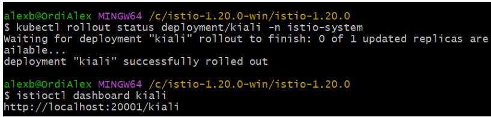

That will redirect to the kali dashboard : 
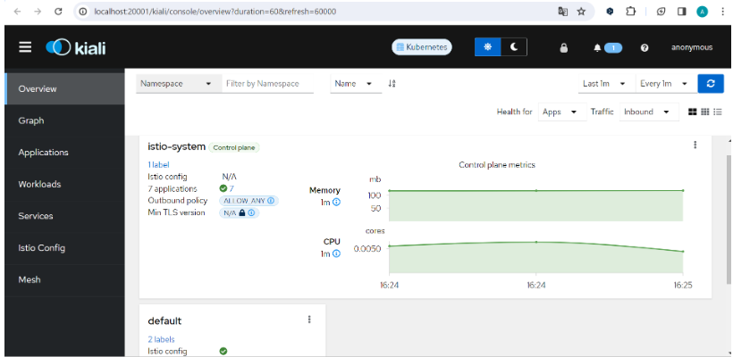
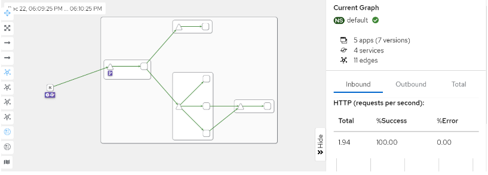

## 2. Routing

First we configure routing for version 1, using Istio API instead of Gateway API because it made some problems : 
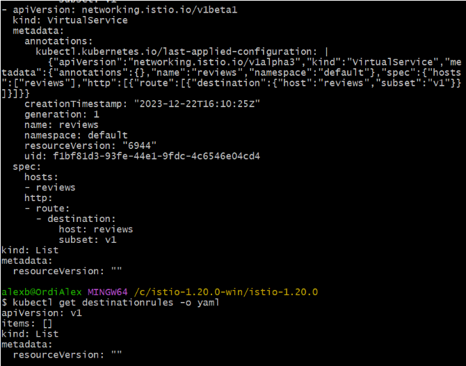

Then we can see the results, where we indeed see the reviews from jason user, with now no stars : 
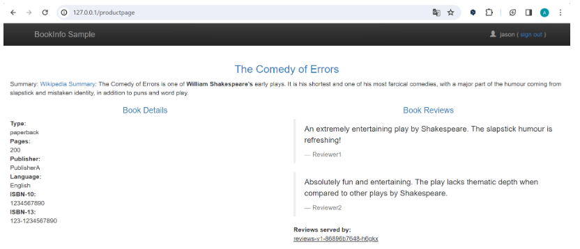

Then we configure the routing with the user identity. Results of routing with user identity : We now, logged as jason, see reviews with different kind of stars.
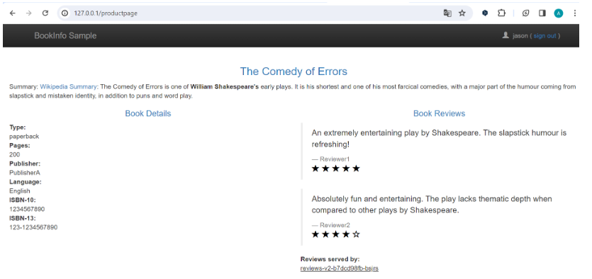

But if we log with another user : 
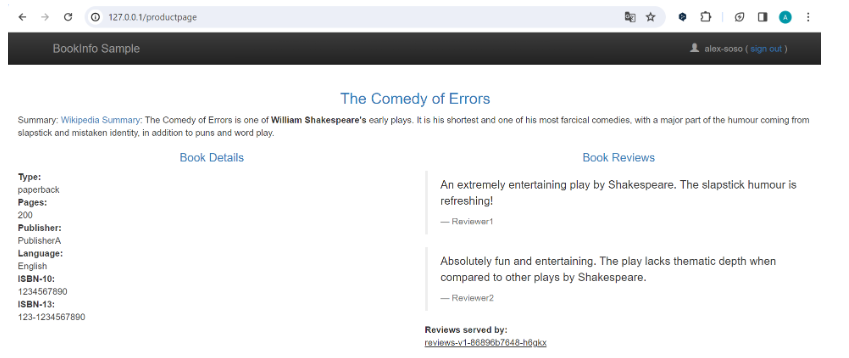
Results of routing with user identity : We now, logged as alex-soso, see reviews with no stars. It means that it works because only jason have stars. In fact, it’s because traffic is routed to reviews:v1 for all users except Jason.

## 3. Traffic Shifting : 

First step : 
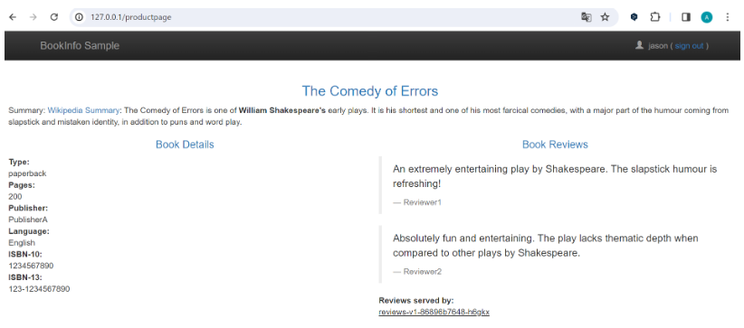

Now thanks to this first step of traffic shifting, No users at all (including jason) can see reviews with stars.

And for the last step of this lab, which mean we decided that that the reviews:v3 microservice is stable, we can route 100% of the traffic to reviews:v3. We can see the results : 
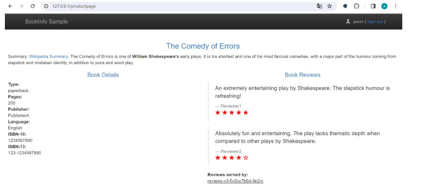
We can see that when we Refresh the /productpage several, we always see book reviews with red colored star ratings for each review.


